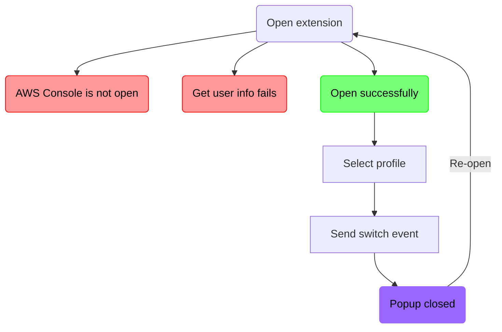
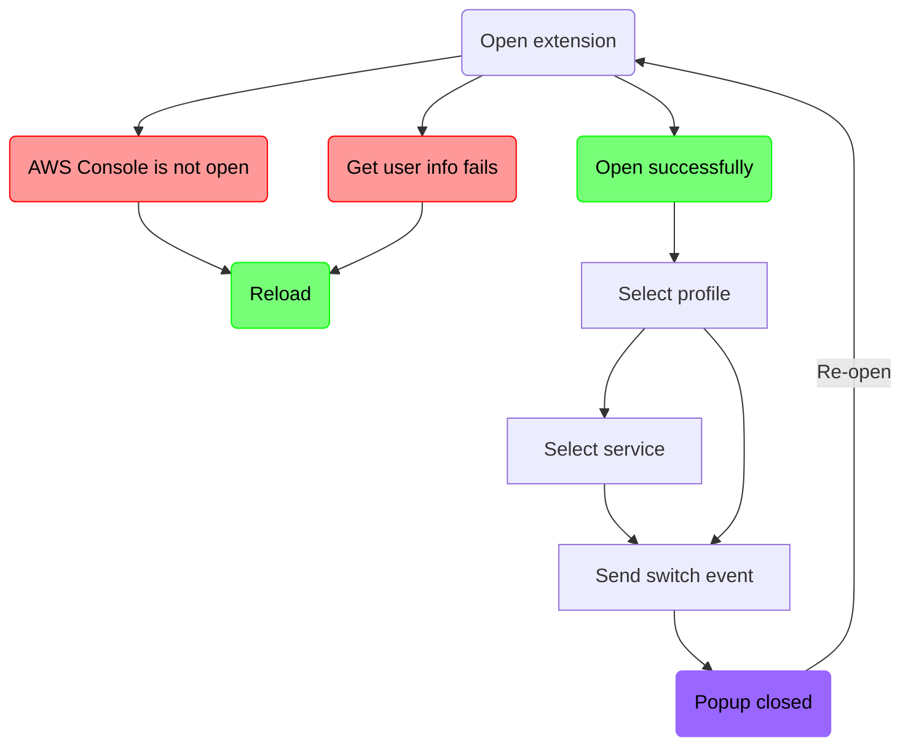

# Extend AESR
### Fork of [tilfinltd/aws-extend-switch-roles](https://github.com/tilfinltd/aws-extend-switch-roles)

### List of modifications
- [x] Set Ctrl-Shift-P as keybinding
- [x] Build and load extension
- [x] Open an account
- [x] Switch accounts
- [x] Open URI `console.aws/ec2/` instead of `console.aws/`
- [x] Unit tests still pass after my edit
- [x] Remove the update notice
- [ ] Add useful debug logs
- [x] Add an checkbox to hide the sidebar
- [x] On opening, go back to last tab with URL like `aws.amazon.com`
- [x] On profile change, close all AWS tabs
- [x] Open service menu on key pressed
- [x] Handle simultaneous service switch and role switch
- [x] Add icons for the list of services
- [ ] Add filter support for the list of services
- [ ] Allow user to edit icons order in JSON
- [x] Add arrow keys support
- [x] Add arrow keys support for the list of services
- [ ] Align account number to the right
- [ ] Make account numbers selectable
- [ ] Add a Console entry
- [x] On message `Failed to fetch user info`, reload the tab
- [ ] Fix: scroll down when selected service is down below
- [ ] Tests: fix test createRoleListItem -> profile has minimum properties -> returns li element
- [ ] Tests: learn to write UT for chrome extension
- [ ] Package and upload to Web store ?
- [ ] Make a github.io page with GIFs

### How does AESR work ?
- popup.js
  - window.onload = func(){ ... }
    - main()
      - getCurrentTab().then()
        - if url.host.endsWith('.aws.amazon.com')
          - executeAction(tab.id, action='loadInfo', data={})
            - return chrome.tabs.sendMessage(tabId, { action, data })
          - .then(userInfo)
            - if (userInfo)
              - loadFormList(tab.url, userInfo, tab.id)
                - charge des profiles
                - appelle renderRoleList()
                  - appelle getCurrentURL()
                  - on définit le callback `listItemOnSelect()`
                    - qui appelle `sendSwitchRole(tabId, data)`
                      - qui `executeAction()` sur notre `tabId` avec l'event `'switch'` et les `{data}`
              - document.getElementById('main').style.display = 'block'
                → displays anchor `main` from `popup.html`

            - else → `Failed to fetch user info from the AWS Management Console page`
        - else → `You'll see the role list here when the current tab is AWS Management Console page.`

- popup.html
  - anchor `main` (div)
    - anchor `roleFilter` (input)
    - anchor `roleList` (ul)

### Proposition to improve user flow
Current user flow diagram

New user flow proposition

